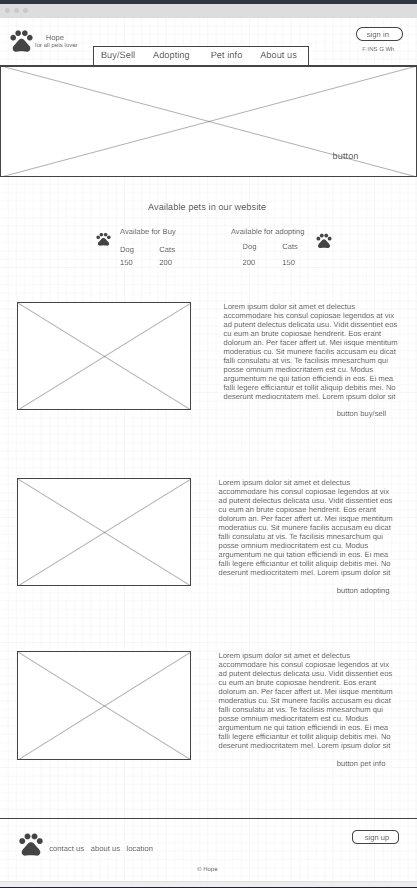
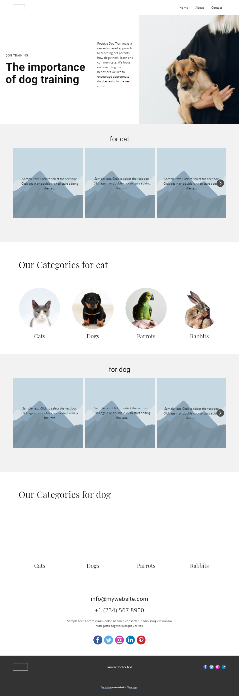
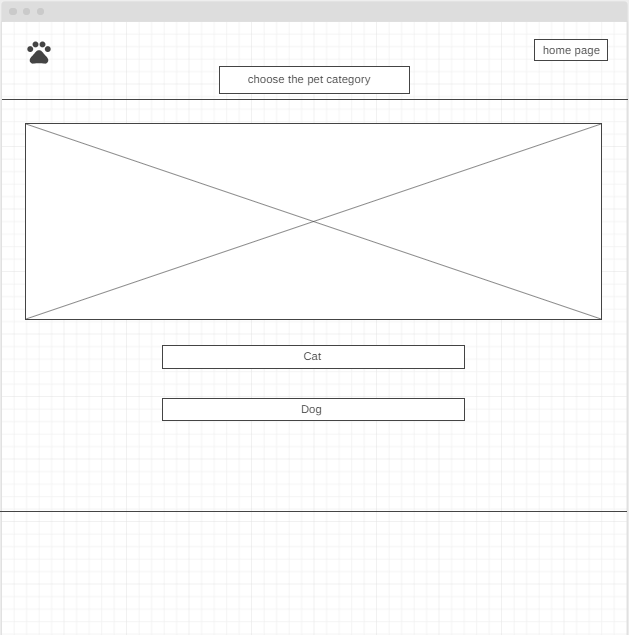
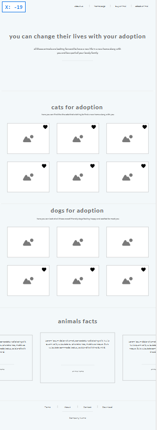
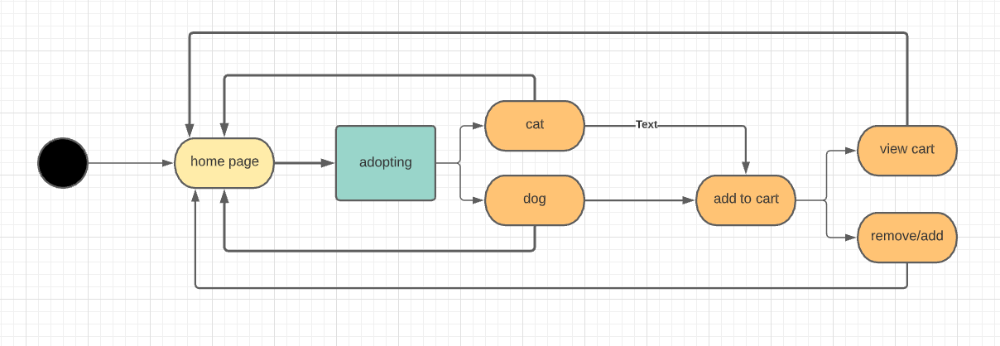

# Task1:

the main problem is there is no online adoption for dogs and cats in Jordan and there is a lot of pets that need help and Each year, over 2.7 million dogs and cats are killed each year because shelters are overcrowded and there are not enough homes for anymore.

1. the home page will give the user information about what the website contains
2. pet info will contain the information about all pets that we have
3. the adopting page will let user choose to adopt cat or dog
4. page contact us to help user if he had any problem

# task1.2:

1. Inaccurate Estimations: Though estimations are a typically inevitable a part of software development (because of the pressure from customers or alternative stakeholders to get a timeframe), they'll create risk if the estimations create expectations that can’t be met. Inaccurate estimations happen as a result of the length of a project, milestone or iteration is underestimated by the project group. and we solve all this by deleting some of the pages is not important.
2. Scope Variations: Scope variations occur when the scope of an iteration changes after a timeframe had been agreed upon. and we solve it by edit fast
3. bad communication with our team and this let us have a less time to manage all project
4. Poor Quality Code: When a project's quality falls short of stakeholder expectations, there's a good chance it won't succeed.

# wireframe

## homepage

## petinfo

## chosing

## buying

## Local storge:

local Storage is a property that allows JavaScript sites and apps to save key-value pairs in a web browser without having to worry about them expiring. This means that the data stored in the browser will survive the closing of the browser window.
And I used local storge to save in cart

## Agile model:

Agile is one form of software development methodology.
The main focus is on client satisfaction through continuous delivery
agile project sets a minimum range of requirements and turns them into a deliverable
product.

### The Agile model has 7 stages described below:

- Requirement gathering and analysis
- Design
- Implementation or coding
- Testing
- Deployment
- Maintenance

### Requirement gathering and analysis:

- The end result the project is going to achieve

- The features that it will support.

- The features that it will not initially support.

- On further iterations, the Client and the Product Owner review the requirements and make them more relevant.

- Define the requirements for the iteration based on the product backlog, sprint backlog, customer and stakeholder feedback

### Design:

- All the different technical questions that will seem on this stage are mentioned by all the stakeholders

- defined the technologies used in the projec team load, limitations, time frames, and budget.

- project decisions are created according to the defined necessities

### Implementation or coding:

- Implementation or Coding starts once the developer gets the Design document.
- The software design is translated into source code. All the components of the software system are implemented during this phase

### Testing:

- Testing starts once the coding is complete and also the modules are released for testing. in this phase, the developed software system is tested thoroughly and any defects found are assigned to developers to induce them fixed.

- Retesting, regression testing is finished until the point at that the software system is as per the customer’s expectation. Testers refer SRS document to make sure that the software system is as per the customer’s standard.

### Deployment:

- Once the product is tested, it's deployed in the production environment or first User Acceptance testing is finished depending on the client expectation.

### Maintenance:

- After the deployment of a product on the production environment, maintenance of the product i.e. if any issue comes up and needs to be fixed or any improvement is to be done is taken care by the developers.
# Testing technique 
Black box testing is a technique of software testing which examines the functionality of the software without peering into its internal structure or coding. The primary source of black-box testing is a specification of requirements that are stated by the customer. In this method, the tester selects a function and gives input value to examine its functionality, and checks whether the function is giving the expected output or not. If the function produces correct output, then it is passed in testing, otherwise failed. The test team reports the result to the development team and then tests the next function. After completing testing of all functions if there are severe problems, then it is given back to the development team for correction.
Generic steps

- The black box test is based on the specification of requirements, so it is examined in the beginning.
- In the second step, the tester creates a positive test scenario and an adverse test scenario by selecting valid and invalid input values to check that the software is processing them correctly or incorrectly.
- In the third step, the tester develops various test cases such as decision table, all pairs test, equivalent division, error estimation, cause-effect graph, etc.
- The fourth phase includes the execution of all test cases.
- In the fifth step, the tester compares the expected output against the actual output.
- In the sixth and final step, if there is any flaw in the software, then it is cured and tested again.
# refrances
- https://www.forbes.com/sites/stevedenning/2016/08/13/what-is-agile/?sh=2f7fd5f226e3
- https://www.wrike.com/project-management-guide/faq/what-is-agile-methodology-in-project-management/
